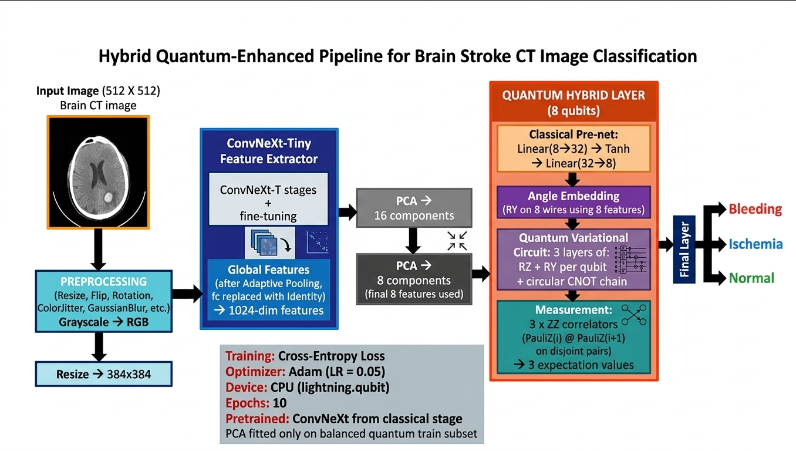
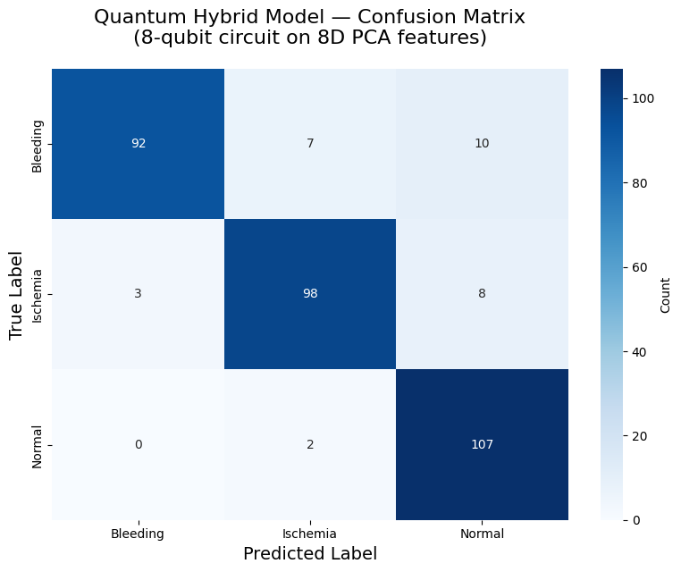
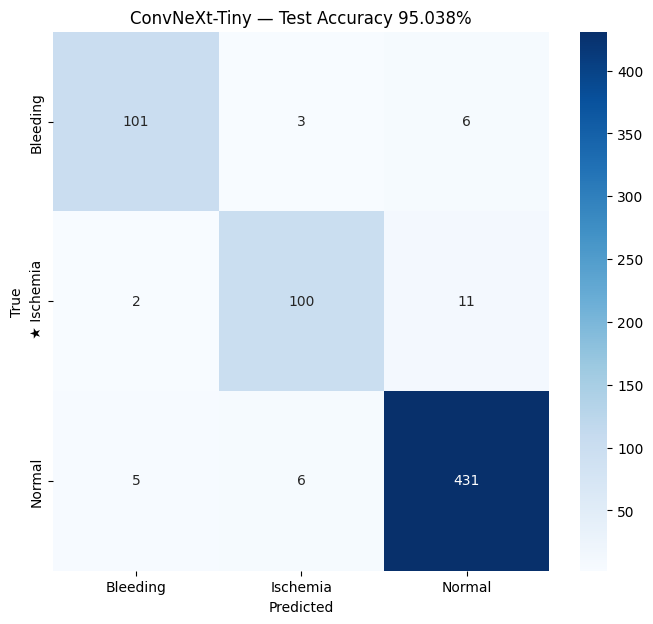
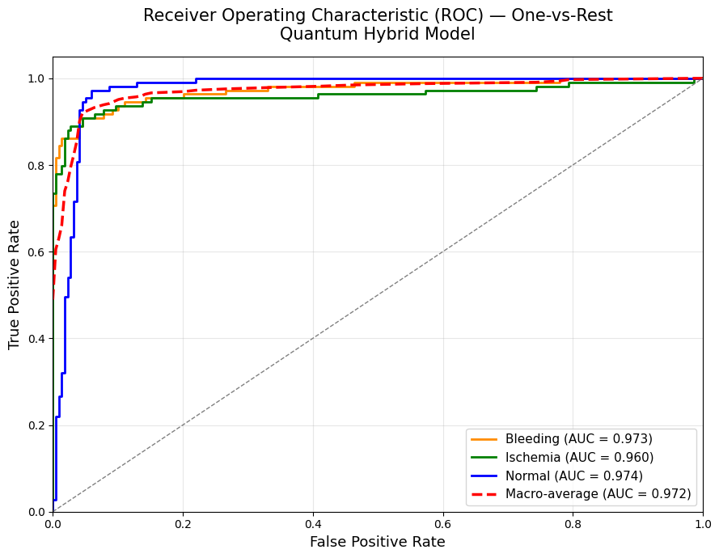

# 🧠 Hybrid Quantum–Classical Stroke Classification Using CT Images

## 📖 Abstract

Stroke is a leading cause of death and long-term disability worldwide. Accurate and early classification of stroke type is essential for effective treatment and clinical decision-making.

This project presents a **hybrid quantum–classical machine learning framework** for automated **stroke classification** using **CT brain images**.

The proposed system integrates:

- Deep learning-based feature extraction
- Dimensionality reduction
- Quantum machine learning for classification

### 🔹 Stroke Classification

- Uses **ConvNeXt-Tiny (transfer learning)** for feature extraction
- Applies **Principal Component Analysis (PCA)** to reduce feature dimensions
- Uses an **8-qubit Variational Quantum Circuit (VQC)** for classification

The model classifies CT images into:

- Ischemic Stroke
- Hemorrhagic Stroke
- Normal

The system is evaluated using:

- Accuracy
- Precision
- Recall
- F1-score

This hybrid approach demonstrates the potential of **quantum-enhanced models** in medical image classification.

---

# 🧠 Classification Pipeline

The classification module identifies the **type of stroke** present in CT brain images.



### Steps involved:

1. CT image input
2. Image preprocessing and resizing
3. Feature extraction using ConvNeXt-Tiny
4. Dimensionality reduction using PCA
5. Quantum classification using Variational Quantum Circuit
6. Final prediction output

---

# 📂 Dataset

Dataset used:

https://www.kaggle.com/datasets/ozguraslank/brain-stroke-ct-dataset

### Dataset Classes

- Ischemia
- Hemorrhage
- Normal

### Dataset Format

```
PNG images → CT scan images
```

### Preprocessing Steps

- Train/Test split (80 / 20)
- Image resizing to 224 × 224
- Normalization

---

# ⚙️ Installation

```bash
pip install torch torchvision scikit-learn pennylane opencv-python numpy
```

---

# 🚀 Usage

### 1️⃣ Download Dataset

```bash
kaggle datasets download -d ozguraslank/brain-stroke-ct-dataset -p ./dataset
unzip dataset/brain-stroke-ct-dataset.zip -d ./dataset
```

---

### 2️⃣ Run the Model

Use the provided notebook:

```
fixed_notebook.ipynb
```

Update dataset path inside the notebook and run all cells.

---

# 🧠 Model Architecture

### Classical Component

- ConvNeXt-Tiny (feature extraction)
- PCA (dimensionality reduction)

### Quantum Component

- 8-qubit Variational Quantum Circuit
- Strongly entangling layers

---

# 📊 Evaluation Metrics

- Accuracy
- Precision
- Recall
- F1-Score

---

# 📊 Results

### Confusion Matrix




---

### ROC Curve



---

# 🎯 Key Features

✔ Hybrid Quantum–Classical architecture  
✔ Transfer learning using ConvNeXt  
✔ Efficient dimensionality reduction using PCA  
✔ Quantum-enhanced classification  
✔ End-to-end automated pipeline  

---

# 🔮 Future Improvements

- Scale to higher qubit quantum circuits
- Integrate real quantum hardware (IBM Quantum)
- Optimize quantum circuit depth
- Deploy as clinical decision support system

---
